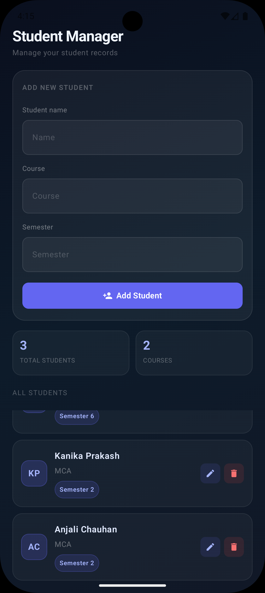

# 🎓 Student Manager App

A modern Android application built using **Kotlin**, **Jetpack Compose**, **Room Database**, **MVVM Architecture**, **Kotlin Flow**, and **StateFlow**.

The application allows users to manage student records with complete CRUD (Create, Read, Update, Delete) functionality while providing automatic UI updates through a reactive architecture.

---

## ✨ Features

### Student Management

* ➕ Add New Students
* 📋 View All Students
* ✏️ Edit Student Details
* 🗑️ Delete Students
* 🔄 Real-Time UI Updates

### Database

* 💾 Local Data Persistence with Room Database
* 📦 Structured Data Storage
* ⚡ Fast Data Access

### Architecture

* 🏗️ MVVM Architecture
* 📦 Repository Pattern
* 🔄 Reactive Programming with Flow & StateFlow
* 🎯 Separation of Concerns
* ⚡ Automatic UI Synchronization

---

## 🛠 Tech Stack

| Technology         | Purpose                 |
| ------------------ | ----------------------- |
| Kotlin             | Programming Language    |
| Jetpack Compose    | Modern UI Toolkit       |
| Material 3         | UI Components           |
| Room Database      | Local Storage           |
| MVVM               | Architecture Pattern    |
| Repository Pattern | Data Layer Management   |
| Coroutines         | Asynchronous Operations |
| Flow               | Reactive Data Stream    |
| StateFlow          | UI State Management     |

---

## 📂 Project Architecture

```text
UI (Compose)
      │
      ▼
ViewModel
      │
      ▼
StateFlow
      │
      ▼
Repository
      │
      ▼
DAO
      │
      ▼
Room Database
```

---

## 🗄️ Database Schema

### StudentEntity

```kotlin
@Entity(tableName = "students")
data class StudentEntity(

    @PrimaryKey(autoGenerate = true)
    val id: Int = 0,

    val name: String,

    val course: String,

    val semester: Int
)
```

---

## 🔥 CRUD Operations

### Create

Add new student records.

### Read

Display all students stored in the database.

### Update

Edit and update existing student information.

### Delete

Remove students from the database.

---

## ⚡ Reactive Architecture

This project uses **Kotlin Flow** and **StateFlow** for reactive UI updates.

### Data Flow

```text
Room Database
      ↓
Flow
      ↓
Repository
      ↓
StateFlow
      ↓
Compose collectAsState()
      ↓
Automatic UI Updates
```

Whenever data changes in the database:

* Insert Student
* Update Student
* Delete Student

The UI updates automatically without manually refreshing data.

---

## 🧠 Key Concepts Practiced

* Room Database Integration
* MVVM Architecture
* Repository Pattern
* ViewModel & ViewModel Factory
* State Management
* Coroutines
* Kotlin Flow
* StateFlow
* CRUD Operations
* Reactive Programming
* Modern Android Development

---

## 🚀 Getting Started

### Clone Repository

```bash
git clone https://github.com/IronMan0208/Student-Manager.git
```

### Open Project

Open the project in Android Studio.

### Run Application

Build and run on an Emulator or Physical Device.

---

## 📸 Screenshots

### 🌟 Splash Screen

<p align="center">
  
</p>

### 🏠 Main Screen

<p align="center">
  
</p>

---

## 🔮 Future Enhancements

* 🔍 Search Students
* 📊 Student Statistics Dashboard
* 🌙 Dark Mode Support
* 🏷️ Course-Based Filtering
* 📅 Admission Date Tracking
* ☁️ Firebase Integration
* 🔐 User Authentication
* 📤 Export Student Data

---

## 👨‍💻 Author

**Ajay Kumar**

Android Developer focused on building modern Android applications using Kotlin, Jetpack Compose, Room Database, MVVM Architecture, Flow, and Clean Architecture principles.

GitHub: https://github.com/IronMan0208

---

## ⭐ Support

If you found this project useful, please consider giving it a ⭐ on GitHub.
